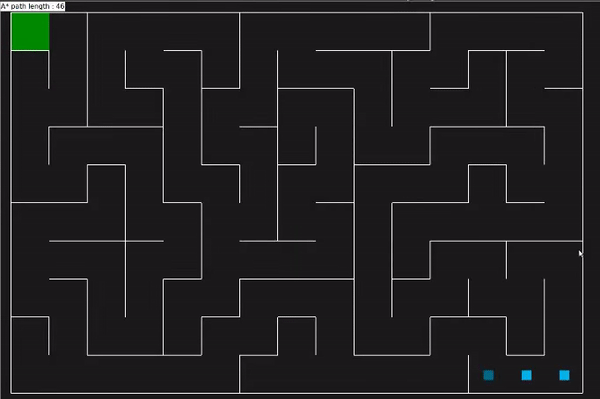

# A* Maze Solver
Maze solver using A* pathfinding.

# Assets
- Pyamaze for randomized mazes
- PriorityQueue for implementing priority queue.

# Features
The Heuristic function determines the cheapest path from the start to the goal using the manhattan distance between two cells. PriorityQueue is then used to pick the cell with the lowest cost.

# Demo
